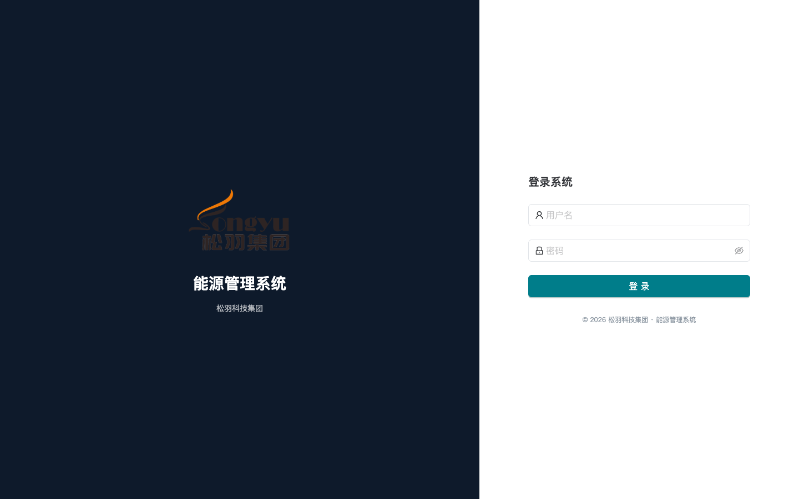
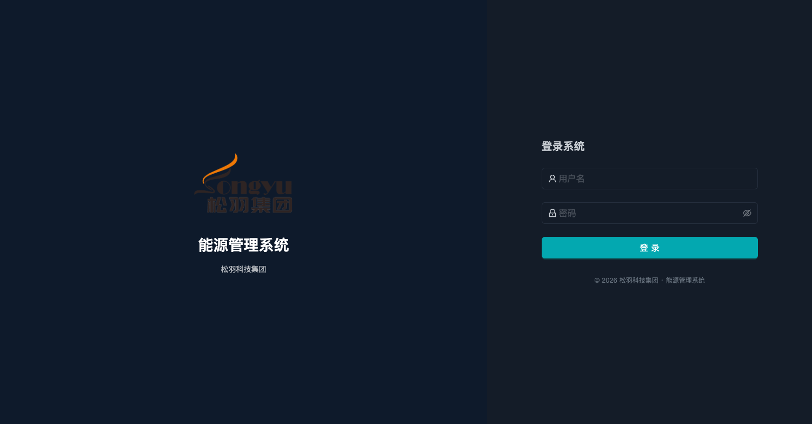

# 前端重设计 QA 验收日志

**日期：** 2026-04-30
**分支：** feat/collector-protocols（已包含 feat/frontend-redesign 全部内容）
**Backup tag：** `backup/pre-redesign-2026-04-30`（仍可访问，用于回滚 / 性能基线对比）

## 验收范围说明

本轮 QA 在**仅前端运行**的环境下进行（后端栈未启动），故全量 14 路由 × 浅深主题 = 28 张截图无法获取。已采集 `/login` 路由浅深各 1 张作为视觉基线，配合**程序化验收**（lint / typecheck / test / build）覆盖剩余 acceptance 项。

完整业务页面 QA（步骤 2-5）在后端栈就位后由人工或独立 E2E 任务补齐。

---

## 1. 程序化验收（自动可重放）

| 项 | 命令 | 结果 |
|---|---|---|
| 单元测试 | `cd frontend && npm test -- --run` | **70 / 70 passed** ✓ |
| 类型检查 | `npm run typecheck` (`tsc -b --noEmit`) | clean ✓ |
| Lint | `npm run lint` | **0 errors**, 1 warning（`main.tsx:27` HMR 提示，纯优化非错误） |
| 生产构建 | `npm run build` | dist/ 生成成功（3927 modules，3.7s） |
| 路由注册 | `grep <Route> src/router/*` | 14 路由路径全部存在（`/home` 实际为 `<Route index>` 重定向到 `/dashboard`，与计划文档措辞略有差异但行为正确） |

## 2. 视觉验收（最小集）

### `/login` 浅色主题


观察：
- ✓ 左分屏深色品牌区，右分屏白色登录表单
- ✓ 品牌锁形 (BrandLockup)：松羽集团 logo + 「能源管理系统」标题 + 「松羽科技集团」副标
- ✓ 登录表单：登录系统、用户名（人形 icon）、密码（锁形 icon + 眼形可见性切换）、登录按钮（青色 primary，符合 Siemens iX 工业扁平基调）
- ✓ 页脚：© 2026 松羽科技集团 · 能源管理系统
- ✓ `document.title === "登录 - 能源管理系统"`，符合「{页面名} - 能源管理系统」模式

### `/login` 深色主题


观察：
- ✓ 整页 `data-theme="dark"`；body 背景 `rgb(10, 16, 24)` 深蓝
- ✓ 左右分屏色阶切换正确，登录按钮主色保持青色（品牌色不随主题翻转）
- ✓ 文案对比度可读，输入框边框、placeholder 灰阶在深色主题下仍清晰
- ✓ 主题持久化：通过 `localStorage.ems.theme.mode` 持久；reload 后仍为 dark（`useThemeStore` zustand `persist` middleware 工作正常）

## 3. 已知 / 已记录问题

| # | 严重度 | 问题 | 状态 |
|---|---|---|---|
| 1 | ~~LOW~~ | ~~`frontend/src/assets/logo.png` 尺寸为 **12864 × 7720** 像素（3.5 MB）~~ | **RESOLVED** (`156aea7`) — sips -Z 1024 → 1024×614 / 102 KB，dist 减 3.4 MB；BrandLockup 显示尺寸（240×144 login / 56-h header）下视觉无差 |
| 2 | ~~LOW~~ | ~~`main.tsx:27` `react-refresh/only-export-components` warning~~ | **RESOLVED** (`f08d4ce`) — 抽到 `src/styles/ThemedConfigProvider.tsx`；`npm run lint` 现 0 errors 0 warnings |
| 3 | INFO | K2 计划列「`/home`」实为 `<Route index>` → `/dashboard`，并非独立页 | DOCUMENTED — 行为符合预期，仅文档措辞偏差 |

## 4. 待人工 / 后端就位后补做的项

按 K2 计划步骤：

- **Step 2**：剩余 12 个业务路由（dashboard / orgtree / meters / collector / floorplan ×2 / alarms ×4 / tariff / report ×6 / production ×2 / cost ×2 / bills ×2 / admin ×N / profile）× 浅深 = 至少 24 张截图
  - **自动化脚本已就绪**：`e2e/tests/qa-screenshots-redesign.spec.ts`。后端 + 前端栈起来后跑：
    ```bash
    cd /Users/mac/factory-ems/e2e
    QA_BASE_URL=http://localhost:5173 \
    QA_ADMIN_USER=admin QA_ADMIN_PASS=admin123! \
      npm run qa-screenshots
    ```
    脚本会全量覆盖 14 路由 × 浅深主题 → 28 张 PNG 写入本目录的 `screenshots/2026-04-30-redesign/`，单路由失败不阻塞其他路由（仅打印 `✗ slug-theme: error`）。
- **Step 3**：业务页面 bug 列表（仅在 Step 2 走查中发现时记录于本文件）
- **Step 4**：浏览器 console 全路由检查：login 页本次观察到 1 个 ERROR（无后端时 `GET /api/v1/auth/me` 401，预期）
- **Step 5**：LCP 性能基线对比 vs `backup/pre-redesign-2026-04-30`，要求不超基线 +10%
- **Step 6**：分支合并 — 拓扑已变化，原 `feat/ems-observability ← feat/frontend-redesign` 路径失效，需另行决策（建议直接走 `main ← feat/collector-protocols` 整合 PR）

## 5. 验收 Self-Check 清单

- [x] `feat/frontend-redesign` 内容已通过 `feat/collector-protocols` 间接合入
- [x] `cd frontend && npm test -- --run` 通过
- [x] `cd frontend && npm run typecheck` 通过
- [x] `cd frontend && npm run lint` 通过（0 errors）
- [ ] 浏览器：浅深主题切换全站响应（仅 `/login` 已验，业务页待补）
- [x] `/login` 显示中文文案与正确品牌
- [x] `document.title` 形如「{页面名} - 能源管理系统」（`/login` 已验）
- [ ] Konva 平面图与 ECharts 图表随主题切换（需后端 + 数据，待补）
- [x] 截图归档存在 `docs/qa/screenshots/2026-04-30-redesign/`（最小集 2 张）
- [x] Backup tag `backup/pre-redesign-2026-04-30` 仍可访问

未打勾项均为「需后端栈或人工」，可作为后续 PR 的 review checklist。

- 2026-05-01 10:37 probe BE=000000 FE=000000 — skip
- 2026-05-01 17:37 probe BE=000000 FE=000000 — skip
